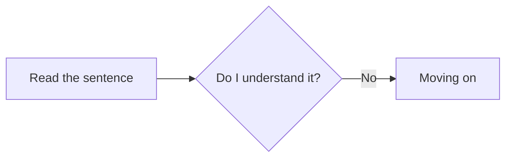

<figure markdown="span", class="miningoverview-img">
  
  <figcaption style="margin-top: 0.25em; margin-bottom: 0.5em;">Flowchart of the mining process in immersion.</figcaption>
</figure>

#### An Overview of Mining

You read through the sentence, check what you understand. If you there is something you don't know in a sentence or are unsure about then use Yomitan. After doing so reread the sentence, or the part that you didn't understand, with the information you looked up and see for yourself if you can understand the sentence now. 

- If you can; mine it and move on

- If you can't; spend more time trying to understand the sentence. If you can't understand the sentence, no problem, move on. 

Now rinse and repeat these steps for all sentences! This is immersion!

---

#### Whitenoising

After reading a sentence for the first time, if [don't understand a sentence](../Mining/step 2 comprehension check.md#check-your-understanding-and-see-what-you-can-understand-for-yourself) and **still** move on to the next sentence then thats considered whitenoising.
Moving one without having tried to understand a sentence is whitenoising and should be avoided at all costs. You learn nothing by just glossing over a sentence or letting something play in the background without paying attention. It's just a time waste.

#### Checking yourself is a good habit

Whitenoising happens to everyone, but confident people are the most prone. Confident people think they might know a word and don't bother checking themselves and move on, which can backfire. This can get to a point of learning words wrong. For example you might think you know a word because you have seen it being used so much, but actually don't know what it means. You think you know but you actually don't so you basically gaslit yourself into thinking you do. This doesn't mean you should check yourself always when immersing but once in a while doesn't hurt to avoid cases like these. 

On the other hand people who doubt themselves are not really prone to whitenoising because when they see an unfamiliar expression they usually opt to look it up. The same holds true for thinks they are unsure about, so naturally they spend more time with each given sentence. 

Being confident is not bad it doesn't hurt being confident in your ability but it also doesn't hurt looking things up sometimes you think you know to check yourself. Both are good qualities but only in moderation. Be a confident and doubtful person! Check yourself once in a while!

#### Flowing while immersing

If you think you know a word its most often better to check yourself once in a while by quickly looking it up with Yomitan. Otherwise you will experience learning a word wrong you thought you know. Being doubtful of yourself is can be one's superpower but pausing too much to check yourself can break your immersion in whatever medium. There is this balance you should keep and to illustrate this let's talk about the *flow* in immersion.

!!! note "Disclaimer"
    This is only applicable to people who are more advanced. 

We can rewrite the steps we have outlined for [the process of mining](../Mining/step 1 read the sentence.md) using the [ratio](core concepts of immersion.md#the-ratio) discussed earlier: 80-85% of the time immersing should optimally be spent in **pattern recognition** (understanding sentences immediately) while 15-20% of the time we should spend in **problem solving** (pausing and trying to understand a sentence thoroughly). 

This is the sweet spot where you flow, where you are immersed in whatever medium you are consuming at the moment without pausing i.e interrupting your immersion too often. Since its hard to come by a lot of sentences after each other where we get sentences like i+1, reaching the flow state is rare. But let's strive towards it!

=== "Pattern recognition"

    - [Reading the sentence for the first time](../Mining/step%201%20read%20the%20sentence.md#read-through-the-sentence-normally-dont-panic)

    - [Did I immediately understand the sentence?](../Mining/step%202%20comprehension%20check.md#check-your-understanding-and-see-what-you-can-understand-for-yourself)

=== "Problem solving"

    - [Using Yomitan to look up things you don't know or understand](../Mining/step%203%20yomitan.md#use-yomitan-to-look-up-what-you-dont-know)

    - [Rereading the sentence trying to understand what it now means.](../Mining/step%204%20reread%20sentence.md#reread-the-sentence-or-the-part-where-that-word-you-just-looked-up-appears-in-and-try-to-understand-the-sentence)
    
    - [Spending more time on the sentence](../Mining/step%206%20spending%20more%20time.md#if-you-dont-understand-the-sentence-then-spend-more-time-on-it-to-understand-what-its-trying-to-say)

#### Which dictionaries to use

To start out I recommend using a bilingual dictionary that uses definition in a language you understand, at best your native language. If available use multiple dictionaries to cover everything you might encounter immersing because some words are in some dictionaries while not in others.
Different dictionaries will describe the same word differently. This will make understanding a new word easier for you, in case you don't understand a dictionary entry.

#### When to switch to monolingual dictionaries

*To be added*

---

-   :material-play-circle:{ .lg .middle } __Start Mining__

    ---

    Begin the step-by-step mining process to understand sentences and add words to Anki.

    [:octicons-arrow-right-24: Next sentence](../Mining/step 1 read the sentence.md)

