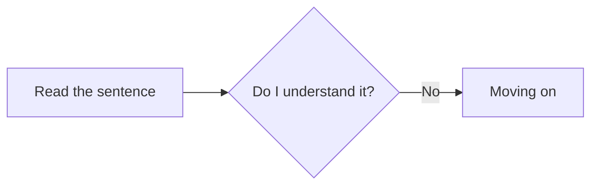

!!! tldr ""

    *summary to be added*

## An Overview of Mining

<figure markdown="span", class="miningoverview-img">
  
  <figcaption style="margin-top: 0.25em; margin-bottom: 0.5em;">Flowchart of the mining process in immersion.</figcaption>
</figure>

You read through the sentence, check what you understand. If you there is something you don't know in a sentence or are unsure about then use Yomitan. After doing so reread the sentence, or the part that you didn't understand, with the information you looked up and see for yourself if you can understand the sentence now. 

- If you can; mine it and move on

- If you can't; spend more time trying to understand the sentence. If you can't understand the sentence, no problem, move on. 

Now rinse and repeat these steps for all sentences! This is immersion!

---

## Whitenoising

After reading a sentence for the first time, if [don't understand a sentence](../Mining/step 2 comprehension check.md#check-your-understanding-and-see-what-you-can-understand-for-yourself) and **still** move on to the next sentence then thats considered whitenoising.
Moving one without having tried to understand a sentence is whitenoising and should be avoided at all costs. You learn nothing by just glossing over a sentence or letting something play in the background without paying attention. It's just a time waste.

## Checking yourself is a good habit

Whitenoising happens to everyone, but confident people are the most prone. Confident people think they might know a word and don't bother checking themselves and move on, which can backfire. This can get to a point of learning words wrong. For example you might think you know a word because you have seen it being used so much, but actually don't know what it means. You think you know but you actually don't so you basically gaslit yourself into thinking you do. This doesn't mean you should check yourself always when immersing but once in a while doesn't hurt to avoid cases like these. 

On the other hand people who doubt themselves are not really prone to whitenoising because when they see an unfamiliar expression they usually opt to look it up. The same holds true for thinks they are unsure about, so naturally they spend more time with each given sentence. 

Being confident is not bad it doesn't hurt being confident in your ability but it also doesn't hurt looking things up sometimes you think you know to check yourself. Both are good qualities but only in moderation. Be a confident and doubtful person! Check yourself once in a while!

## Flowing while immersing

If you think you know a word its most often better to check yourself once in a while by quickly looking it up with Yomitan. Otherwise you will experience learning a word wrong you thought you know. Being doubtful of yourself is can be one's superpower but pausing too much to check yourself can break your immersion in whatever medium. There is this balance you should keep and to illustrate this let's talk about the *flow* in immersion.

!!! note "Disclaimer"
    This is only applicable to people who are more advanced. 

We can rewrite the steps we have outlined for [the process of mining](../Mining/step 1 read the sentence.md) using the [ratio](core concepts of immersion.md#the-ratio) discussed earlier: 80-85% of the time immersing should optimally be spent in **pattern recognition** (understanding sentences immediately) while 15-20% of the time we should spend in **problem solving** (pausing and trying to understand a sentence thoroughly). 

This is the sweet spot where you flow, where you are immersed in whatever medium you are consuming at the moment without pausing i.e interrupting your immersion too often. Since its hard to come by a lot of sentences after each other where we get sentences like i+1, reaching the flow state is rare. But let's strive towards it!

=== "Pattern recognition"

    - [Reading the sentence for the first time](../Mining/step%201%20read%20the%20sentence.md#read-through-the-sentence-normally-dont-panic)

    - [Did I immediately understand the sentence?](../Mining/step%202%20comprehension%20check.md#check-your-understanding-and-see-what-you-can-understand-for-yourself)

=== "Problem solving"

    - [Using Yomitan to look up things you don't know or understand](../Mining/step%203%20yomitan.md#use-yomitan-to-look-up-what-you-dont-know)

    - [Rereading the sentence trying to understand what it now means.](../Mining/step%204%20reread%20sentence.md#reread-the-sentence-or-the-part-where-that-word-you-just-looked-up-appears-in-and-try-to-understand-the-sentence)
    
    - [Spending more time on the sentence](../Mining/step%206%20spending%20more%20time.md#if-you-dont-understand-the-sentence-then-spend-more-time-on-it-to-understand-what-its-trying-to-say)

## Dictionaries

### Which dictionaries to use

To start out I recommend using a bilingual dictionary that uses definition in a language you understand, at best your native language. If available use multiple dictionaries to cover everything you might encounter while immersing because some words are in some dictionaries while not in others.
Different dictionaries will describe the same word differently. This will make understanding a new word easier for you, in case you don't understand a dictionary entry.

### Monolingual transition

!!! info "Intermediate Learners"

    This section is targeted at "intermediate" learners.

During your immersion journey you should switch from a bilingual dictionary to a monolingual dictionary. This is called the monolingual transition. A monolingual dictionary is a dictionary that defines a word using its own language. A common monolingual dictionary for the English language is the Oxford English Dictionary, for German it's the Duden. Some languages have a monolingual dictionary online like Naver for Korean. 

#### Why use a monolingual dictionary

!!! success "Strengths"

    - You will learn the full nuance, connotation and usage which are hard to translate. Monolingual dictionaries clarify whether "smart" is more like intelligent, clever or well dressed, bilingual dictionaries don't. 

    - You avoid false associations. Many words don't have a perfect one-to-one translation so relying on bilingual dictionaries can lead to errors.

    - Helps you think in your target language, since a word is explained using it.

#### When to switch to monolingual dictionaries

It's hard to pinpoint an exact time when to go monolingual. It also varies by person and how comfortable you are with your target language, but I would say around the time reading becomes more so *easier* maybe a bit more *effortless* than it used to be at the beginning. This at least after having read one or two books and you start to encounter words in different contexts and *sense* there's more to it than your bilingual definition is apparently telling you. It's also around the same time you want to read more challenging things, which doesn't mean going from finishing your first real reading material to your second one but more so from your second to your third.

#### How to transition to monolingual dictionary

Use multiple monolingual dictionaries in [Yomitan](https://yomitan.wiki/) since different monolingual dictionaries will define the same word differently, helping you pick up the *feeling* of a word. Prioritize their orderings so every time you look up a word first you should see the monolingual dictionaries then to read through your bilingual dictionary you should have to scroll down in Yomitan then be able to see it. This small detail of having to scroll down may seem insignificant but it adds another barrier between you defaulting back to your bilingual dictionary because they are easier to understand.

When looking up a word first try to read through the majority of your monolingual dictionaries first and see if you can understand the word from that alone. If you can great job and add the definition you like the most to your Anki card. If you can't then don't worry about it and read through the bilingual dictionary, then go back and read through the monolingual dictionaries and see if you can understand them now. If you can then add the monolingual definition to your card (maybe along side the bilingual one) or just add the bilingual one if you don't feel comfortable enough to understand the word during reviews justs by the monolingual definition.
Rinse and repeat this process for the monolingual transition.

#### What to expect during the monolingual transition

- A lot of unknown words

You will probably be "dictionary diving" and looking up words within dictionaries popups. The word you don't know within dictionaries are just normal words you just don't know yet so to fix that [read more](types of immersion.md#solution-just-read-more). You can mine these words within dictionaries but keep in mind [when to mine and when not mine](../Mining/step%205%20mine%20it.md#when-to-mine-and-not-mine).

!!! note "Small anecdote"
    I remember mining a word once 5 dictionary pop-ups deep. Meaning I looked up a word within a definition within a definition within a definition within a definition. Let's try to avoid deep diving!

---

-   :material-play-circle:{ .lg .middle } __Start Mining__

    ---

    Begin the step-by-step mining process to understand sentences and add words to Anki.

    [:octicons-arrow-right-24: Next sentence](../Mining/step 1 read the sentence.md)

---

*[i+1]: one unknown piece of information