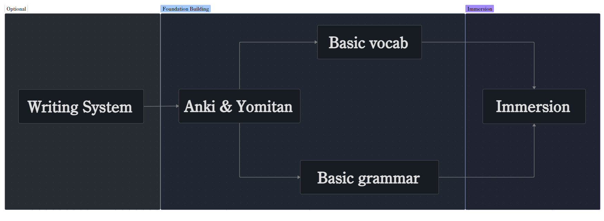

# Before starting immersion

!!! tldr ""

    1. Optional: Learn enough of the writing system to read somewhat.

    2. Install Anki:

        - Anki = spaced repetition system to learn vocab (use beginner community deck).

    3. Build a rough foundation:

        - 1000-1500 of the most commonly used words (Anki deck).
        
        - Basic grammar understanding (basic particles, patterns, word order, tenses).

    4. Start with immersion as soon as possible, meaning when you hit those numbers.

    5. Skip the perfectionist loop, jump into immersion.

Further reading:

[1. :octicons-arrow-right-24: Writing system](#writing-system)

[2. :octicons-arrow-right-24: Main tool for building a foundation](#main-tool-for-building-a-foundation)

[3. :octicons-arrow-right-24: Building a foundation](#building-a-foundation)

[4. :octicons-arrow-right-24: When can I start to immerse](#when-can-i-start-to-immerse)

[5. :octicons-arrow-right-24: The beginner loop](#the-beginner-loop)

## Overview

In this section I will give you a flowchart you can follow to go through before starting immersion (=consuming content made by natives for natives in your target language that is comprehensible enough, enjoyable and somewhat challenging). For each step I'll explain what to do and what to look out for before moving to the next step. 

<figure markdown="span", class="miningoverview-img">
  
  <figcaption>Roadmap before starting immersion</figcaption>
</figure>

!!! abstract "Disclaimer from [Home](../index.md)"

    This guide explains how to learn a language using the immersion method. It does **not** provide language specific resources. Instead it focuses on what makes up immersion and it's principles; what it is, how it works, and how you can use it yourself.

    The specific kind of media and resources you consume and use for immersion will depend on your target language. For example if you want to learn Japanese then you won't learn Korean words. For concrete resources and setup guides, please refer to "language specific immersion guides", such as [天・Ten (Heaven)](https://www.ten.guide/) for Japanese. These kind of guides focus mainly on resources, media and tools. 

    Think of this guide as a paintbrush, that offers you the method and mindset, while the colors, language resources like media and setup guides for tools, come from materials tailored to your target language. 

---

## Writing system

!!! note "This step is optional depending on your target language."

First you might need to learn the writing system *to some extent* first before going through the next steps. You need to be able to read in your target language to some extent before starting to learn words.
How much of the writing system you end up having to learn depends on your target language.

---

## Main tool for building a foundation

This section is about Anki, one of the two main tools that make up immersion language learning. For setup guides refer to your "language specific immersion guide" like [天・Ten (Heaven)](https://www.ten.guide/) for Japanese.

### What is Anki

Anki is a flashcard program that uses a spaced repetition system helping you remember vasts amount of information in the long term as efficiently and underwhelming as possible. It does so by optimizing memory retention by showing you flashcards you created right before you forget them, maximizing retention with minimal study time.

*In general Anki supports powerful customization and rich media support, allowing for add-on functionality for advanced features and offline accessibility. It's extremely efficient for learning anything from languages to complex medical facts.*

!!! note "Installation"
    For information how to install it refer to the official [website](https://apps.ankiweb.net/).  
    For [Android](https://play.google.com/store/apps/details?id=com.ichi2.anki) and [IOS](https://apps.apple.com/us/app/ankimobile-flashcards/id373493387).

---

## Building a foundation

This is the real first step as it prepares you for consuming media in your target language (immersing). Here you first need to learn enough basic vocabulary and grammar to build a foundation good enough to immerse. This step usually takes weeks to complete depending on your time.

To learn vocabulary you go through a beginner deck in Anki. 

To learn grammar you go through a beginner grammar resource.

### Basic vocabulary

!!! success "Learn [basic grammar](#basic-grammar) at the same."

Which Anki deck you use to learn these basic vocabulary depends on your language, so please refer to your "language specific immersion guide", like [天・Ten (Heaven)](https://www.ten.guide/) for Japanese. They have a starter deck for Japanese.

If the language you're studying doesn't have a starter Anki deck to learn basic vocabulary, a language specific immersion guide or a community, then you can also look for vocabulary decks on the Anki website under [shared decks](https://ankiweb.net/shared/decks).

#### Going through beginner Anki decks

A starter Anki deck should full full these requirements so you get the most out of it:

1. It has at least 1000 to a maximum of 1500 different words for you to memorize.

2. The majority of the deck should contain frequently used vocab. The more frequent words you know the easier your first immersion experience will be.

3. Doesn't contain any to no obscure rarely used words.

4. Doesn't contain any to no country names.

5. Doesn't contain complex sentences with rare words that were not introduced already.

6. Uses simple phrases (statement, existence / possession, commands, negatives, exclamations, identification, localization etc.)

7. The design of each flashcard should at least look like this:

=== "Front"

    - The word you want to memorize and nothing else.

=== "Back"

    1. Definition of that word in a language you understand (optimally your native language)
    2. An example sentence that uses that word in your target language
    3. An accurate translation of that sentence.
    4. Clear and correct audio playing how that word is read i.e pronounced. At best a native.
    5. A picture to help understanding the meaning

---

[:octicons-arrow-right-24: When can I start to immerse?](#when-can-i-start-to-immerse)

---

!!! question "My target language doesn't have a starter deck from a dedicated community"

    Use any deck you find online that full fills at least the first 3 requirements of the back. 

!!! question  "My target language doesn't have any deck online"

    Create your own starter deck using word and frequency lists or divert back to textbook vocabulary lists.

---

### Basic grammar

!!! success "Learn [basic vocabulary](#basic-vocabulary) at the same."

Which language resource you use to learn basic grammar depends on your language, so please refer to your "language specific immersion guide", like [天・Ten (Heaven)](https://www.ten.guide/) for Japanese. They have tons of starter resources for grammar.

If the language you're studying doesn't have a starter grammar resource to learn basic grammar, a language specific immersion guide or a community, then you can also look for grammar resources online on blog posts and youtube.

#### Going through beginner grammar resources

A starter grammar resource should prime you on what's out there to help you understand:

- How sentences are usually structured ("anatomy") and look like in your target language. 

- Basic grammar particles and cases, meaning you can name and recognize basic grammar patterns and understand how they **roughly** work. 

- Basic nouns

- Basic verbs

- Basic negation

- Basic statement patterns

- Basic existence / possession

- Basic commands / requests

- Basic tenses

- Basic exclamations 

- Basic identification

!!! warning "Take basic grammar explanations in beginner grammar guides at face value. Most grammar guides are flawed in one way other another."

---

[:octicons-arrow-right-24: When can I start to immerse?](#when-can-i-start-to-immerse)

---

## When can I start to immerse?

It's hard to pinpoint and articulate a level of proficiency that is best suited for diving into immersion, but having learned the majority of a [beginner Anki deck](#basic-vocabulary) and having learned basic grammar from a [beginner grammar resource](#basic-grammar) would be considered a foundation decent enough to jump into native media. Concretely this means:

!!! success "The right way - You start when"
    
    - You know around 1000-1500 of the most common words.

    - You have a rough understanding of your target language's grammar. 
    
    Combining these two factors builds a foundation comfortable enough to start immersing. 

A few disclaimers:

1. You don't need to have finished your [beginner Anki deck](#basic-vocabulary) to start immersing.

2. You don't need to have memorized all the grammar points in your [beginner grammar resource](#basic-grammar) to start immersing.

3. If you have some experience with your target language already then going through a [beginner Anki deck](#basic-vocabulary) and [beginner grammar resource](#basic-grammar) nonetheless doesn't hurt. 

### The beginner loop

These disclaimers exist to keep beginners away from the beginner loop:

!!! failure "The wrong way"

    Memorizing and learning all the grammar of your target language and thousands upon thousands of vocab before actually immersing for the first time.

    "Making sure" you know every single detail and nuance of the basics in and out to finally start immersing.

At the beginning you have to accept you won't understand everything completely and leave these beginner resources behind as soon as possible. In reality you won't be ready until you actually start engaging with the real language by applying what you learned.

Reusing the hiking analogy from [the essence of immersion](../Introduction/problematic surrounding immersion.md#essence-of-immersion-learn-and-hike) would mean you spend too much time buying the right hiking equipment, studying in depth how their mechanisms work or finding the perfect clothing for every weather condition you might encounter without actually having seen a mountain or set foot onto one. Obviously preparing yourself is good but be it for hiking, language learning or anything else, but without having real experience of doing it you won't progress. No preparation here can save you from struggling or not understanding everything when you start consuming the language, but that's okay, struggling or rather *challenge* is part of the process and actually needed to acquire a language. Don't let your perfectionist mind keep you from actually starting!

### The beginner struggle

!!! warning "Giving up before it begins"
    
    During this foundation building process you will basically be doing only Anki alongside some grammar study. If you already start to hate Anki or doing grammar here, then you lost the beginner immersion mental game. The start before you can immerse is the hardest part.

### Alternatives

Another way could be after having learned your target language to some extent in school or in language classes. You could go through courses on websites where you learn basic phrases, grammar and vocabulary, although I wouldn't recommend them even if you like them especially if your target language has a [beginner Anki deck](#basic-vocabulary) and [beginner grammar resources](#basic-grammar). In the end what matters is having a **decent foundation in the language** to start immersing. 

---

!!! question "Why take explanations from beginner grammar guides at face value?"

!!! question "How much challenge is too much and why is it part of the process?" 

!!! question "How much should I understand at the beginning?"

!!! question "What should I look for in immersion media?"

These questions will be answered in the next section [:octicons-arrow-right-24: Principles of Immersion](core concepts of immersion.md#principles-of-immersion).

---
