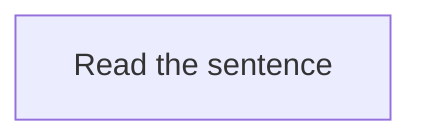

## The process of mining

To illustrate the process of how to mine, let's pretend we are learning a language called "Volga Tatar". I will use the same example sentence from [core concepts of Immersion](../Immersion/core concepts of immersion.md#example-sentence). For clarity reasons, the sentence will not be written in complete Volga Tatar and instead in English and with one unknown word that is written in Volga Tatar.

"While her brother was quiet and reserved, Maria was incredibly сөйләмчәк, telling long, detailed stories at dinner, chatting easily with strangers, and always having an opinion to share." 

---

### Read through the sentence normally. Don't panic.

You read through the sentence like you would do in your native language. This doesn't mean as fast as you can. Here you read attentively and make sure you have actually read over everything, while thinking along, trying to imagine what the sentence is saying. You may as well take mental notes as in noticing what you maybe didn't understand immediately in the sentence.

-   :material-brain:{ .lg .middle } __Ready for the next step?__

    ---

    Now that you've read the sentence, check your understanding.

    [:octicons-arrow-right-24: Check understanding](step 2 comprehension check.md#check-your-understanding-and-see-what-you-can-understand-for-yourself)

---