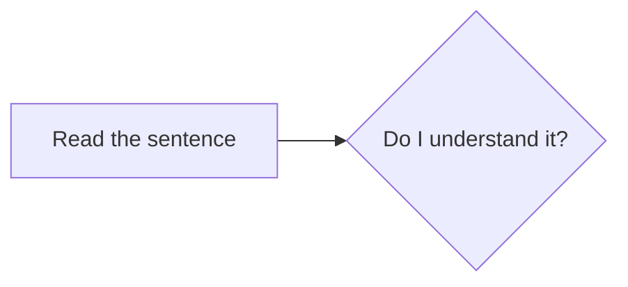

## The Process of Mining

To illustrate the process of how to mine, let's pretend we are learning a language called "Volga Tatar". I will use the same example sentence from [principles of Immersion](../Immersion/core concepts of immersion.md#example-sentence). For clarity reasons, the sentence will not be written in complete Volga Tatar and instead in English and with one unknown word that is written in Volga Tatar.

"While her brother was quiet and reserved, Maria was incredibly сөйләмчәк, telling long, detailed stories at dinner, chatting easily with strangers, and always having an opinion to share." 

---

### Check your understanding and see what you can understand for yourself.

In any case after having read through the sentence, good job!. Now you only move on to the next one after being sure you understood what the sentence said.

#### How to approach understanding a sentence

Being sure, means most importantly there weren't any unknown words to you or you could comprehend what the sentence is about. This doesn't mean you translate the sentence literally to yourself. It means you understand the sentence within the target language using the target language. You are basically looking to comprehend what the sentence is saying for yourself, such that *if you had to* translate the sentence you could give *your* best take at communicating what the sentence is about. You don't need to explain to yourself every time after finish reading a sentence what it tries to says, you just need to be like "Okay I get what they said". It's the same as in English where you usually don't actually pause and think about what a sentence said. You basically want to understand the sentence using your target language and using whatever appears in the sentence to understand it. You want to use as little of English as possible to understand each sentence. **After all you want to use the sentence in the target language to understand the sentence itself** like we have outlined in the i+1 sections.

#### How immersing feels

This "understanding process" should be engaging and "hard". We are putting in cognitive effort into understand the sentence with the target language. We're absorbing what we see and try to make sense of the patterns we see. It's a learning process so it's meant to be like that, thats how learning usually is.
Here you don't want to actually step back and ask yourself "How much did I understand?". You ideally want to feel a mix of enjoyment, engagement, accomplishment or excitement being interested to find out more about what ever you're reading as well as challenge and mental effort. (Remember the ratio 80-85% enjoyment and 15-20% challenge)

#### The ambiguity problem

At the beginning most things will be vague since as a beginner you have no idea if the gist is conveyed or not. You basically can't know for sure what you don't know. You most often can't really recognize *everything* you don't know or can break it down enough. To put it more frankly you can't always know whether you understood a sentence completely because you don't have enough knowledge of the target language to check yourself. There is always something missed as in the unknown unknowns. This is something I refer to as the *ambiguity problem*. There will almost always be a lingering ambiguity in a given sentence you just can't grasp yet.

To give you an idea how much understanding is enough and what to aim for, here are a few examples:

=== "98% comprehension"

    You live and work in Tokyo. Tokyo is a big city. More than 13 million people live around you. You are never borgle, but you are always lonely. Every morning, you get up and take the train to work. Every night, you take the train again to go home. The train is always crowded. When people ask about your work, you tell them, “I move papers around.” It’s a joke, but it’s also true. You don’t like your work. Tonight you are returning home. It’s late at night. No one is shnooling. Sometimes you don’t see a shnool all day. You are tired. You are so tired…

=== "95% comprehension"

    In the morning, you start again. You shower, get dressed, and walk pocklent. You move slowly, half- awake. Then, suddenly, you stop. Something is different. The streets are fossit. Really fossit. There are no people. No cars. Nothing. “Where is dowargle?” you ask yourself. Suddenly, there is a loud quapen—a police car. It speeds by and almost hits you. It crashes into a store across the street! Then, another police car farfoofles. The police officer sees you. “Off the street!” he shouts. “Go home, lock your door!” “What? Why?” you shout back. But it’s too late. He is gone.

=== "80% comprehension"

    “Bingle for help!” you shout. “This loopity is dying!” You put your fingers on her neck. Nothing. Her flid is not weafling. You take out your joople and bingle 119, the emergency number in Japan. There’s no answer! Then you muchy that you have a new befourn assengle. It’s from your gutring, Evie. She hunwres at Tokyo University. You play the assengle. “…if you get this…” Evie says. “…I can’t vickarn now… the important passit is…” Suddenly, she looks around, dingle. “Oh no, they’re here! Cripett… the frib! Wasple them ON THE FRIB!…” BEEP! the assengle parantles. Then you gratoon something behind you…

(In case you're not a native speaker of English or don't quite get it, yes, there are nonsense words in there. Those represent the uncomprehended 2%. [:octicons-arrow-right-24: Source](https://www.sinosplice.com/life/archives/2016/08/25/what-80-comprehension-feels-like))

In our [ratio](../Immersion/core concepts of immersion.md#the-ratio) of 80-85% comprehension and 15-20% challenge, the range 80-85% is equivalent to around 95% comprehension.

---

-   :material-check-circle:{ .lg .middle } __Understand everything?__

    ---

    Move on to the next sentence and continue the mining process.

    [:octicons-arrow-right-24: Next sentence](step 1 read the sentence.md)

-   :material-magnify:{ .lg .middle } __Don't understand?__

    ---

    Use Yomitan to look up unknown words and clarify the meaning.

    [:octicons-arrow-right-24: Look it up](step 3 yomitan.md#use-yomitan-to-look-up-what-you-dont-know)

---

*[i+1]: one unknown piece of information