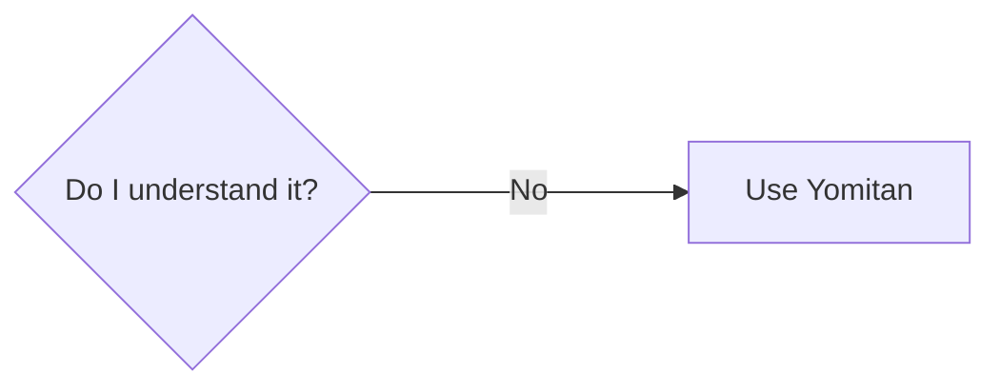

## The process of mining

To illustrate the process of how to mine, let's pretend we are learning a language called "Volga Tatar". I will use the same example sentence from [core concepts of Immersion](../Immersion/core concepts of immersion.md#example-sentence). For clarity reasons, the sentence will not be written in complete Volga Tatar and instead in English and with one unknown word that is written in Volga Tatar.

"While her brother was quiet and reserved, Maria was incredibly сөйләмчәк, telling long, detailed stories at dinner, chatting easily with strangers, and always having an opinion to share." 

---

### Use Yomitan to look up what you don't know

Here you look at the definition in your dictionary what the word you didn't know means. If a word has multiple definitions only focus on the one that is actually used in the sentence.
You find this out by rereading the sentence.

??? note "Tip Use different dictionaries"
    Different dictionaries will describe the same word differently. This will make understanding a new word easier for you, in case you don't understand a dictionary entry.
  
---

-   :material-book:{ .lg .middle } __Ready to reread?__

    ---

    Now that you've looked up unknown words, reread the sentence to check understanding.

    [:octicons-arrow-right-24: Reread sentence](step 4 reread sentence.md#reread-the-sentence-or-the-part-where-that-word-you-just-looked-up-appears-in-and-try-to-understand-the-sentence)

---