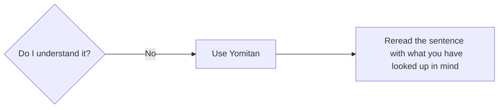

## The process of mining

To illustrate the process of how to mine, let's pretend we are learning a language called "Volga Tatar". I will use the same example sentence from [core concepts of Immersion](../Immersion/core concepts of immersion.md#example-sentence). For clarity reasons, the sentence will not be written in complete Volga Tatar and instead in English and with one unknown word that is written in Volga Tatar.

"While her brother was quiet and reserved, Maria was incredibly сөйләмчәк, telling long, detailed stories at dinner, chatting easily with strangers, and always having an opinion to share." 

---

### Reread the sentence or the part where that word you just looked up appears in and try to understand the sentence.

Using the information you looked up from Yomitan, you reread the sentence and check your understanding again. This is where you are now in "problem solving" mode and actually should question yourself what is the sentence trying to say now that you looked up everything you think you didn't know. In the most likely case, you know feel like you understood the sentence because you looked up the missing puzzle piece(s) and reread the sentence and understood how they are used there. 

!!! success "Mining it"

    After having looked up everything you don't know and understood what the sentence is trying to say you mine the word i.e add it to Anki.

---

-   :material-lightbulb:{ .lg .middle } __Understand the sentence?__

    ---

    Great! Now it's time to mine the word and add it to Anki.

    [:octicons-arrow-right-24: Mine the word](step 5 mine it.md#mine-the-word-you-just-understood)

-   :material-clock:{ .lg .middle } __Still don't understand?__

    ---

    That's okay. Spend more time on the sentence to figure it out.

    [:octicons-arrow-right-24: Spend more time](step 6 spending more time.md#if-you-dont-understand-the-sentence-then-spend-more-time-on-it-to-understand-what-its-trying-to-say)

---