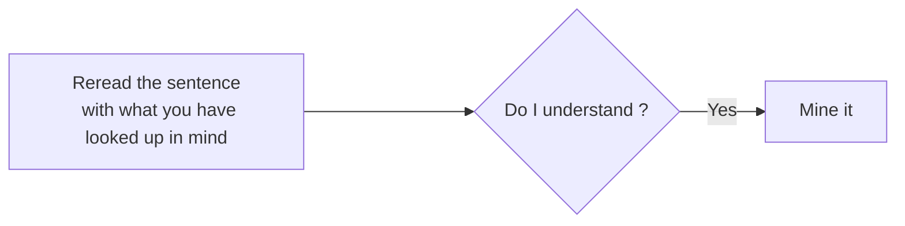

## The process of mining

To illustrate the process of how to mine, let's pretend we are learning a language called "Volga Tatar". I will use the same example sentence from [core concepts of Immersion](../Immersion/core concepts of immersion.md#example-sentence). For clarity reasons, the sentence will not be written in complete Volga Tatar and instead in English and with one unknown word that is written in Volga Tatar.

"While her brother was quiet and reserved, Maria was incredibly сөйләмчәк, telling long, detailed stories at dinner, chatting easily with strangers, and always having an opinion to share." 

### Mine the word you just understood.

Conditions you must fullfil to be here:

- Having gone through steps 1-4.

This means you put in effort to understand the sentence and understand it now.
Then and only then you add it to Anki.

#### When to mine and not mine

Now to make remembering the word you want to mine easier for yourself, you ask yourself if the context given is good enough for your future self to understand the word. Did this sentence, scene or context leave a big enough impression on me learning this word using that exact context. What I want to say is only mine things you understood and that have a memorable enough impression on you to remember later. If you are dealing with a sentence that has a lot of unknown words (i+n) then mining that sentence would be a bad idea because there would be too much ambiguity to actually make the context help you remember the meaning of a given word. If you got such a great context then go ahead and mine it and move on to the next sentence. If you don't then spend more time on the sentence.

You probably have experienced that "big enough impression" sentence yourself before. Maybe there was a movie you watched with a really impression lasting scene where a character said something really impactful to you which made some specific phrase or maybe just a word stick in your mind for a long time. In essence, these impactful moment i.e something you really comprehend makes a new word or phrase stick in your mind. **The stronger the context (the more you understand it) the easier time you have picking up this missing +1 piece.**

#### Avoid high frequency words

If your goal is general fluency then avoid mining high frequencies words, because they wont help you anytime soon especially as a beginner or even intermediate. The higher the frequency of the word the less likely its used and the less natural it usually sounds.

#### Checklist for mining

Here is a simple checklist of things you should do in order:

1. Having gone through steps 1-4
2. Don't mine things you don't understand
3. Don't mine things from sentences you don't understand
4. If a word has multiple definitions, only mine the definition that is used in your sentence.
5. Avoid mining high frequencies words unless they interest you personally

!!! success "What's next"

    After mining the word move on to the next sentence.

---

-   :material-check-circle:{ .lg .middle } __Understand everything?__

    ---

    Move on to the next sentence and continue the mining process.

    [Next sentence](step 1 read the sentence.md)

---