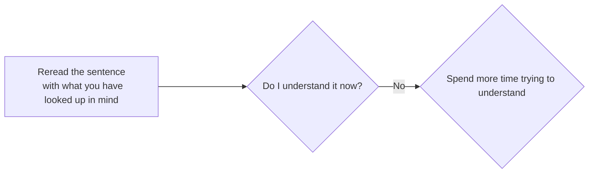

## The process of mining

To illustrate the process of how to mine, let's pretend we are learning a language called "Volga Tatar". I will use the same example sentence from [core concepts of Immersion](../Immersion/core concepts of immersion.md#example-sentence). For clarity reasons, the sentence will not be written in complete Volga Tatar and instead in English and with one unknown word that is written in Volga Tatar.

"While her brother was quiet and reserved, Maria was incredibly сөйләмчәк, telling long, detailed stories at dinner, chatting easily with strangers, and always having an opinion to share." 

---

### If you don't understand the sentence, then spend more time on it to understand what it's trying to say

??? note "Reference: How to approach understanding a sentence"
    
    Being sure, means most importantly there weren't any unknown words to you or you could comprehend what the sentence is about. This doesn't mean you translate the sentence literally to yourself. 
    
    It means you understand the sentence within the target language using the target language. You are basically looking to comprehend what the sentence is saying for yourself, such that *if you had to* translate the sentence you could give *your* best take at communicating what the sentence is about. 
    
    You don't need to explain to yourself every time after finish reading a sentence what it tries to says, you just need to be like "Okay I get what they said". It's the same as in English where you usually don't actually pause and think about what a sentence said. 
    
    You basically want to understand the sentence using your target language and using whatever appears in the sentence to understand it. You want to use as little of English as possible to understand each sentence. **After all you want to use the sentence in the target language to understand the sentence itself** like we have outlined in the i+1 sections.

#### What to do if you don't understand a sentence

If you don't understand what the sentence is trying to say even after having looked up the things you don't know, then that's *fine*. Your goal right now is to just get the gist and understand anything at all. Don't be discourage by being here, this just shows you are putting the effort you need to put in, you're learning right now. Immersion is a learning process. You will have to pause and think, reread, relisten, rewind and rethink again. **If you don't understand something after at max two or three minutes, then move on to the next sentence.**

#### How much time to spend per sentence

You generally want to spend around a one to two minutes with each sentence. You want to "problem solve" the sentences you don't understand instantly (i+1-3s) i.e look up the things you don't know (words, grammar etc.) and secondly you want pattern recognition so absorbing the *feel* of the language the flow so to speak, where you feel out common chunks of the sentence and natural sound of the language (sentence you comprehend without looking things up). You need both but when you spend too much time on a sentence, you are spending more too much time in the "problem solver" mode, even though the pattern recognition mode is what gets you to "fluency". 
Spending too much time on a sentence will just give you mental fatigue and demotivate you which can lead to burn out quicker. Its like losing the forest in the trees, where you understand every word but lose the meaning of the whole sentence/paragraph or scene. Also just frustrating to spend a lot of time every sentence.

!!! success "Your approach"

    Keep in mind this time limit is not definitive! Don't time yourself with every sentence. Just read and try to understand as much as you can.

---

-   :material-check-circle:{ .lg .middle } __Understand it now?__

    ---

    Great! You've put in the effort and it clicked. Time to mine the word.

    [:octicons-arrow-right-24: Mine the word](step 5 mine it.md#mine-the-word-you-just-understood)

-   :material-skip-forward:{ .lg .middle } __Still don't understand?__

    ---

    That's okay. Move on to the next sentence and come back to this later.

    [:octicons-arrow-right-24: Move on](step 7 move on.md#move-on)

