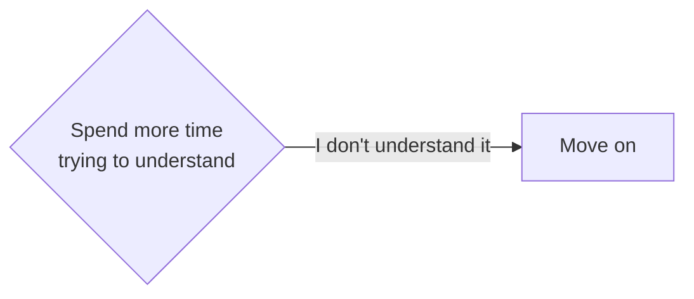

## The Process of Mining

To illustrate the process of how to mine, let's pretend we are learning a language called "Volga Tatar". I will use the same example sentence from [principles of Immersion](../Immersion/core concepts of immersion.md#example-sentence). For clarity reasons, the sentence will not be written in complete Volga Tatar and instead in English and with one unknown word that is written in Volga Tatar.

"While her brother was quiet and reserved, Maria was incredibly сөйләмчәк, telling long, detailed stories at dinner, chatting easily with strangers, and always having an opinion to share." 

---

### Move on

You don't understand the sentence what so ever even after having thought about it really hard.
Move on. Don't mine it just move on. If you just don't understand a sentence even having looked up everything you can and thought about it for like 3 minutes, then you can just move on to the next sentence. 

You can do this because no almost no grammar pattern or word is used once. The sheer amount of immersion i.e exposure to the target language will balance out "skipping" one word or sentence. I should not even say skipping here since you didn't skip it, you put in effort and just weren't able to understand it this time and thats part of the process, thats part of learning. 

That's why its not detrimental to move on, because you will revisit whatever you "missed out on" sooner or later be it consciously when you remember from last time you saw what ever you didn't understand or unconsciously seeing that expression again. Immersion is not about understanding everything every time 100%, its the consistency and effort to understand everything you cana that counts! But don't become comfortable not understanding a sentence and just getting the gist! 

!!! warning "When this becomes a problem"

    If you happen to be here very often, then this might be a sign that whatever you're immersing with might be too hard for you right now. If you keep on immersing with something that is too hard for you, then you run danger of wasting time and burning out. Being here is the exception not the norm. 
    
    [:octicons-arrow-right-24: When to drop things you are immersing with](../Immersion/roadmap.md#when-to-drop-things-you-are-immersing-with)

    [:octicons-arrow-right-24: How to get the most out of Immersion](../Immersion/roadmap.md#how-to-get-the-most-out-of-immersion)

You can move on after you have gone through steps 1-5 (reading the sentence -> checking comprehension -> Looking up with Yomitan -> rereading sentence -> checking comprehension), meaning you:

1. Tried your best to understand the sentence multiple times.

2. Looked up everything you can to the best of your ability.

3. Still couldn't make sense of the sentence.

#### Last resort

As a last resort you can go and translate the sentence to your native language and get that "aha" moment to not lose track of the story or whatever form of entertainment you are immersing in. If you re reading you can just copy paste it. If you are listening then don't bother transcribing it, if it takes a lot of time as in minutes. Try to connect the meaning of the translated sentence with the sentence in your target language before continuing. Don't depend on translating! Try to avoid using the last resort!

---

-   :material-refresh:{ .lg .middle } __Next Sentence__

    ---

    Continue the mining process with the next sentence.

    [:octicons-arrow-right-24: Next sentence](step 1 read the sentence.md)

-   :material-file-document:{ .lg .middle } __Mining Overview__

    ---

    Return to the mining overview.

    [:octicons-arrow-right-24: View Overview](../Immersion/mining notes.md)

---